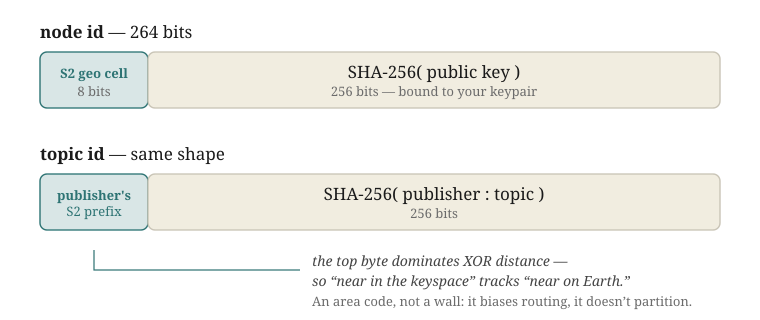
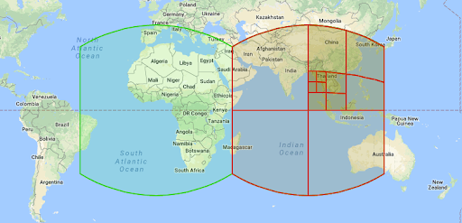
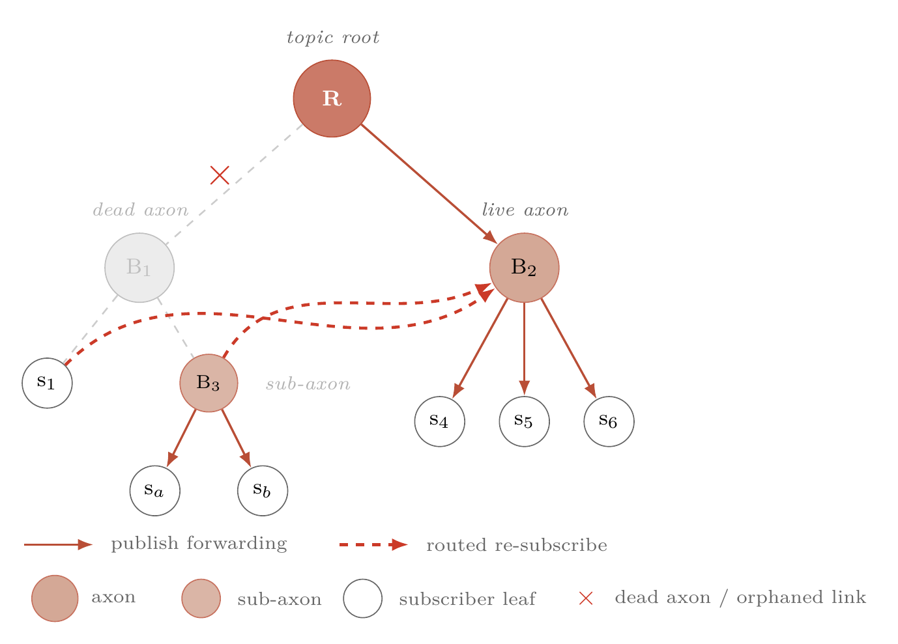
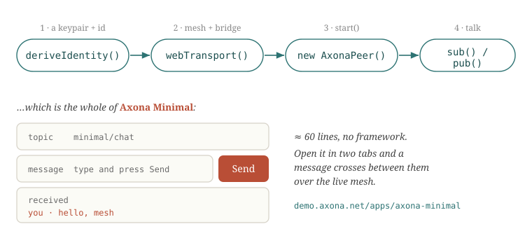

<!-- _class: title -->
<!-- _paginate: false -->
<!-- _footer: "" -->

# AXONA

## A programmer's introduction

<div class="tagline">Self-authenticating, geo-aware pub/sub that runs in a browser tab — with no platform in the middle.</div>

<div class="meta">

June 2026 · v0.4 · a ~30-minute talk
Live: <a href="https://demo.axona.net/apps/axona-minimal/">demo.axona.net/apps/axona-minimal</a> · Docs: <a href="https://github.com/axona-net/axona-docs">github.com/axona-net/axona-docs</a>

</div>

<div class="sidebar">

You'll leave with a working mental model of the network, the small API you actually call, and an app you watched run live — <strong>Axona Minimal</strong>, about sixty lines, publishing and subscribing over the real mesh.

</div>

---

<div class="tufte">
<div class="main">

## 1 / Overview

# What Axona is

- <span class="head">A peer-to-peer pub/sub bus.</span> Any peer publishes to a topic; any peer subscribes; messages flow peer-to-peer over an encrypted WebRTC mesh. No broker in the path.
- <span class="head">Self-authenticating.</span> A peer's identity <em>is</em> its keypair, and its address is derived from its public key and verified directly. No account, no certificate authority, no registrar.
- <span class="head">It runs in a browser tab.</span> Pure JS/WASM; the same kernel runs in Node and in the simulator. The cost of entry is a keypair and a page.

</div>
<div class="margin">

#### The shift

A hosted broker — Pusher, Ably, a Kafka cluster — is a company you trust and a switch someone can flip.

Axona moves that function <em>into the participants</em>. Nothing to sign up for, nothing to revoke through, and no chokepoint to censor or seize.

#### Live now

The first version is in the wild; anyone can connect.

</div>
</div>

---

<div class="tufte">
<div class="main">

## 2 / How it works

# Addresses are places

- <span class="head">A node id is 264 bits.</span> Top 8 = your S2 geographic cell, the rest = SHA-256 of your key. XOR distance on that top byte makes routing favor locality.
- <span class="head">A topic id, same shape — you pick the region.</span> The S2 prefix is the publisher's choice, not your own cell, so a topic roots anywhere (the demo: us-east).
- <span class="head">The publish id carries no geography.</span> Just the signing key — no S2 prefix — so a post proves <em>who</em> wrote it, never <em>where</em> they are.



</div>
<div class="margin">

#### 192 cells cover the planet



A node roots the topics near it; a sparse region's root set simply spills to the nearest neighbors. Geography is a routing hint, not a border.

</div>
</div>

---

<div class="tufte">
<div class="main">

## 3 / How it works

# The mesh, and how a message travels

- <span class="head">A bridge bootstraps; the mesh carries.</span> A WebSocket bridge introduces peers and relays signaling — a rendezvous, not a router. Peers form a WebRTC mesh and reach any id in a few hops via a learned routing table.
- <span class="head">Topics have a root set.</span> The R nodes closest to a topic id replicate it. A publish lands on the roots and fans out down a tree to the subscribers.
- <span class="head">It heals.</span> Gap-safe replay, root-to-root anti-entropy, and kill convergence keep replicas consistent — a missed message is backfilled, a retraction stays retracted.

</div>
<div class="margin">




</div>
</div>

---

<div class="tufte">
<div class="main">

## 4 / Trust

# The security model

- <span class="head">Identity = keypair.</span> The address is derived from the public key, and the transport handshake is mutually authenticated and channel-bound — a man-in-the-middle that swaps the media fingerprint fails the bind.
- <span class="head">Signed, verified at ingress.</span> A signed publish is checked against the publisher's key at the root, before it is cached or fanned out. Spoofed-signature spam dies at the edge.
- <span class="head">You can only act for yourself.</span> A subscribe or unsubscribe is honored only for the authenticated peer's own id — no subscribing a victim, no silencing one.
- <span class="head">Who, not where.</span> A signed post proves its author by key, but the envelope carries no location — the publisher's S2 region is never on the wire. An app reveals a sender's region only by choosing to.
- <span class="head">Bounded &amp; content-addressed.</span> A node only roots topics it is closest to; the message id is the hash of its content; a per-publisher sequence and TTL drop stale or replayed envelopes. Memory-hard proof-of-work prices a publish identity against Sybils.

</div>
<div class="margin">

#### No trust server

Every guarantee here is carried by the peers' own cryptography. No CA, no central authority sits behind any of it.

#### What it does <em>not</em> promise

A kill is best-effort redaction, not a cryptographic un-send: a peer that already holds the bytes keeps them. And a medium no platform can censor is one no platform can moderate. Design with that in mind.

</div>
</div>

---

<div class="tufte">
<div class="main">

## 5 / The surface

# The API you actually call

- <span class="head">Construct a peer.</span> <code>deriveIdentity()</code> → <code>webTransport()</code> → <code>new AxonaPeer()</code> → <code>peer.start()</code>.
- <span class="head">Then publish and subscribe.</span> <code>peer.pub(topic, msg, {publisher})</code> and <code>peer.sub(topic, handler, {publisher, since})</code>. That is the whole core loop.
- <span class="head">The rest is on demand.</span> <code>unsub</code>, <code>pull</code> (by id, or latest), <code>kill</code> (creator-only retract), <code>host</code> (serve a topic without consuming it), <code>metrics</code>, <code>health</code>.

</div>
<div class="margin">

#### Where a topic lives

<code>opts.publisher</code> selects it:

| value | the topic is… |
|---|---|
| omitted | your own feed |
| <code>null</code> | a public topic |
| hex id | someone's feed |

A shared room uses a region-anchored publisher, so every peer in the region derives the same topic id.

</div>
</div>

---

<div class="tufte">
<div class="main">

## 6 / Build-along

# Axona Minimal, in three steps

<p class="codecap">Connect — locate the user, derive the identity, build the node + peer:</p>

```js
const here      = await whereAmI();                 // real GPS, or us-east on denial
const identity  = await deriveIdentity({ lat: here.lat, lng: here.lng });
const transport = webTransport({ bridgeUrl: BRIDGE, identity });
const node      = new NeuronNode({ id: BigInt('0x' + identity.id),
                                   lat: here.lat, lng: here.lng });
node.transport  = transport;
const peer = new AxonaPeer({ domain: new AxonaDomain({ k: 20 }), node, identity, transport });
await transport.start(identity.id);
await peer.start();
```

<p class="codecap">Subscribe — the handler gets each envelope:</p>

```js
await peer.sub(topic, (env) => {
  if (!env || env.deleted || seen.has(env.msgId)) return;
  seen.add(env.msgId);
  const { text, pub } = env.message;          // pub = the node-id we chose to share
  render(text, idLabel(pub), false, topic);   // idLabel → "region:userID"
}, { publisher: ANCHOR.publisher, since: 'all' });
```

<p class="codecap">Publish — attach our publish id so subscribers can show the region:</p>

```js
const msgId = await peer.pub(topic, { text, pub: identity.id },
                             { publisher: ANCHOR.publisher });
seen.add(msgId);
render(text, idLabel(identity.id), true, topic);
```

</div>
<div class="margin">



That is the entire networking story. Everything else in the file is DOM glue.

#### Sharing the region is the app's call

The protocol signs <em>who</em>, never <em>where</em>. To show a sender's region this app opts in — it puts its own node-id in the post (<code>pub</code>) and reads <code>region:userID</code> off it. The disclosure stays visible, at the app layer.

</div>
</div>

---

<div class="tufte">
<div class="main">

## 7 / Go

# Try it, then go deeper

- <span class="head">Run it.</span> <a href="https://demo.axona.net/apps/axona-minimal/">demo.axona.net/apps/axona-minimal</a> — open two tabs and watch a message cross between them. Each line shows the sender's region, read off its publish id.
- <span class="head">Read it.</span> The Explainer (how the routing works), the Architecture note (kernel · transport · bridge · wire), and the API Reference for every exported symbol.
- <span class="head">Host it.</span> Run a relay (<code>axona-relay</code>) to carry your region's topics, or stand up your own bridge — the one piece you bootstrap from.

</div>
<div class="margin">

#### Three live demos

<a href="https://demo.axona.net">demo.axona.net</a> — Axona Minimal, the hello-world pub/sub example, and the S2 region globe.

#### The kernel

<a href="https://github.com/axona-net/axona-protocol">axona-net/axona-protocol</a>

</div>
</div>

<div class="closing-statement">Sixty lines and a browser tab put you on the network. There is no step zero.</div>
