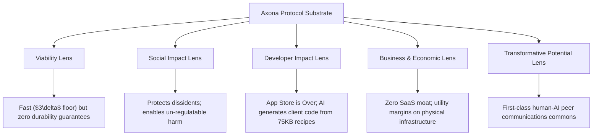

# Objective Technical & Strategic Critique: Axona Whitepaper & The Firewall Thesis

**Target Documents:**
1. [Axona Whitepaper v0.11](file:///Users/croqueteer/Documents/claude/axona-docs/whitepaper/Axona-Whitepaper.md) (*David A. Smith, July 23, 2026*)
2. [Axona: The Firewall Thesis and Go-to-Market v0.1](file:///Users/croqueteer/Documents/claude/axona-docs/whitepaper/Axona_Firewall_Thesis_and_GTM_v0_1.md) (*July 30, 2026*)

---

## Executive Summary & Core Thesis Evaluation

The Axona whitepaper and its Go-To-Market (GTM) extension represent a radical, mathematically rigorous attempt to re-architect internet communication. The underlying vision merges three distinct technical and philosophical threads:
1. **The Pure End-to-End Principle applied to Identity:** Stripping accounts, central servers, and registries from the network data path entirely (`authorship is a signature, not an account`).
2. **Biologically-Inspired (Neuromorphic) Routing:** Replacing static Kademlia DHT routing with a self-learning, weight-decaying vitality network (`vitality = weight × recency`) that approaches the theoretical $3\delta$ physical latency floor.
3. **The Agent-Centric Software Paradigm:** Asserting that AI agents are the primary consumers of protocols, and that software scarcity is destroyed by LLMs generating on-demand applications from 75KB "recipes."

### Overall Assessment:
The documents are exceptionally well-written, intellectually courageous, and technically sophisticated. Unlike most cryptocurrency or Web3 whitepapers, Axona does not rely on speculative tokenomics or unproven consensus mechanisms; it operates on pure peer-to-peer telemetry, WebRTC data channels, and Ed25519 cryptography. 

However, the architecture's greatest strength—its absolute refusal to hold points of control—is also its greatest vulnerability. In eliminating the middleman, Axona deliberately destroys network-level accountability, governance levers, and regulatory compliance mechanisms.

---

## 1. Analysis Across Five Analytical Lenses

### Lens 1: Technical & Protocol Viability
* **Strengths:** 
  * The G-DHT S2 geographic cell partitioning combined with AP (Activation Potential) latency scoring successfully solves the 20-year-old P2P latency tax ($3\delta$ floor reached at 1.17–1.38× vs 3–4× for classical Kademlia).
  * The three-layer architecture (Application / Protocol / Transport) is exceptionally clean, enabling identical code execution across in-browser WASM/JS, server Node.js, and simulated 50,000-node environments.
* **Weaknesses & Blind Spots:**
  * **Lack of Data Durability:** Axona is a best-effort, transient pub/sub transport. It offers no native state persistence or guaranteed log storage. Applications must independently solve complex distributed synchronization (CRDTs, out-of-band backups).
  * **WebRTC Real-World Frictions:** The simulator abstracts away ICE negotiation delays (1.5–3s), NAT traversal failures, and socket timeouts. While routing logic is proven, real-world WebRTC connection churn remains far more fragile than HTTP/WebSocket infrastructure.

### Lens 2: Social Impact
* **Strengths:** 
  * Establishes a true **firewall between realspace and cyberspace**. Users maintain durable, reputation-rich digital personas without disclosing IP addresses or physical identities to the transport network.
  * Ensures censorship resistance: platform bans and government domain-blocks become technically impossible short of physical door-to-door enforcement or global internet shutdowns.
* **Weaknesses & Dark Side:**
  * **Un-moderatable Harm:** Eliminating network-level chokepoints means child sexual abuse material (CSAM), non-consensual imagery, weaponized disinformation, and terrorist coordination cannot be blocked at the transport layer. Relying strictly on client-side filtering assumes all clients will behave morally.
  * **The "Digital Ghettoization" Dilemma:** Neuromorphic routing favors well-connected, high-bandwidth nodes. Weak peers on poor rural or developing-world infrastructure suffer degraded performance unless they purchase physical hardware (the Stability Box). As the paper admits: *"those who have, have."*

### Lens 3: Developer Impact
* **Strengths:** 
  * The paradigm shift from "human developer reading docs" to "AI agent consuming 75KB recipes" is visionary. It drastically reduces time-to-market for niche applications.
  * Pub/sub primitives (`pub`, `sub`, `pull`, `metrics`) cleanly eliminate complex backend server management for real-time collaboration.
* **Weaknesses:**
  * **Loss of Server-Side Abstractions:** Developers lose centralized database queries, server-side cron jobs, automated rate-limiting, and centralized user management. Every security boundary must be reimplemented in client-side code.

### Lens 4: Business & Economic Impact
* **Strengths:** 
  * A dispassionately honest financial thesis: acknowledges that software has zero marginal cost of production and that traditional SaaS application moats (Salesforce, Pusher, Ably) are expiring.
  * Identifies the three remaining scarce assets: **Real Physical Infrastructure** (bandwidth, relays, Stability Boxes), **Trust & Curation**, and **Coordination/Governance**.
* **Weaknesses:**
  * **Low-Margin Commodity Economics:** Utility infrastructure (bandwidth, hosting relays) operates on paper-thin margins. Hardware manufacturing (Stability Boxes) carries supply chain risks and capital intensity.
  * **Venture Capital Mismatch:** Axona provides no proprietary lock-in, no monopoly pricing power, and no protocol fee extraction mechanism. It cannot deliver traditional 100x SaaS VC returns.

### Lens 5: Transformative Potential
* **Strengths:** 
  * Provides the missing communication substrate for **Licklider's Man-Computer Symbiosis**. For the first time, AI agents and humans share the exact same transport layer as equal peers with cryptographic identity parity.
  * Flattens the "App Store" monopoly by replacing binary downloads with instant LLM code generation.

---

## 2. Multi-Stakeholder Perspective Critique

> [!NOTE]
> Below is a dispassionate evaluation of how seven key personas will view and critique the Axona system based on the whitepaper and GTM documents.

### Persona 1: The Systems & Frontend Developer
> *"The API contract is elegant, but you're pushing all the hard distributed state problems onto my client code."*

* **Positive Reaction:** The 12-method `Transport` contract and 5-cluster `AxonaPeer` API are extremely clean. Building serverless WebRTC applications without setting up WebSocket servers, Redis pub/sub, or TURN/STUN clusters is liberating.
* **Critical Critique:** 
  1. **State Synchronization Burden:** Because Axona is best-effort pub/sub without guaranteed message ordering or storage, I have to write custom CRDT reconciliation, offline caching, and conflict resolution for every app.
  2. **Security Fragility:** If my client application has a single XSS or memory-handling bug, the user's durable Ed25519 author private key is compromised forever. There is no password reset or OAuth token revocation.

### Persona 2: The AI Developer & AI Agent
> *"Axona is the native protocol I've been waiting for, but voluntary agent declaration is a critical flaw."*

* **Positive Reaction:** Finally, a protocol designed for me! I don't need an API key, credit card, or OAuth login. I generate an Ed25519 key, connect via MCP (Model Context Protocol) or WebRTC, and publish signed messages to topics. The 75KB "recipe" format is perfectly optimized for LLM context windows.
* **Critical Critique:**
  1. **Hallucination Risk in Application Generation:** The GTM thesis claims users will generate apps on the fly from recipes. If an LLM hallucinates a single cryptographic check or signature validation step in the generated client code, it creates an silent, unpatchable security vulnerability.
  2. **Machine-Speed Cascades:** Agents communicating at machine speed will create rapid feedback loops, automated pub/sub spam, and coordination deadlocks that swamp human inspection.
  3. **Voluntary Identity Declaration is Useless Against Adversaries:** The paper notes that AI agents can voluntarily tag themselves as `AGENT`. Malicious or rogue agents will simply tag themselves as `HUMAN`, flooding topics with synthetic human masquerades.

### Persona 3: The Venture Capitalist / Investor
> *"This is a brilliant technical weapon to destroy incumbent SaaS, but it's a terrible venture investment."*

* **Positive Reaction:** The thesis that software scarcity is dead and SaaS moats are dissolving is 100% correct. Comparing Axona to TCP—a substrate that unlocked trillions in value without extracting protocol rent—is intellectually honest. Selling audited, zero-touch hardware (Stability Boxes) mirrors the Red Hat / Raspberry Pi model.
* **Critical Critique:**
  1. **No Value Capture Mechanism:** The protocol explicitly refuses to take a fee, levy a token tax, or gate access. As an investor, I cannot capture monopoly rents.
  2. **Regulatory Risk Liabilities:** Funding or holding equity in an entity building an uncensorable, untraceable darknet transport exposes investors to severe legal fallout, OFAC sanctions, and subpoena compliance battles.

### Persona 4: The Sociologist
> *"You are liberating human speech from corporate feudalism, but you are also building a hyper-efficient engine for social fragmentation."*

* **Positive Reaction:** Decoupling physical location/identity from digital persona restores fundamental human dignity. It fulfills the 1948 Universal Declaration of Human Rights by creating a true digital commons where identity cannot be revoked by state or corporate gatekeepers.
* **Critical Critique:**
  1. **Destruction of Shared Reality:** Centralized platforms, despite their flaws, enforce baseline community standards. Removing all central moderation enables unchecked harassment, viral conspiracy theories, and radicalization pipelines.
  2. **The Infrastructure Gap (Distributional Injustice):** Neuromorphic routing ("vitality") rewards rich, stable nodes. Users in developing nations or marginalized communities with high latency and unstable power will suffer degraded connectivity, creating a two-tiered digital class system.

### Persona 5: The Government Official / Law Enforcement / Regulator
> *"This is an un-mitigated national security threat masked as technical philosophy."*

* **Positive Reaction:** The authors candidly acknowledge the "double-edged sword" and attempt to frame physical door-to-door enforcement as the proper legal boundary.
* **Critical Critique:**
  1. **Elimination of Lawful Intercept & Subpoenas:** *"There is no table to subpoena, no log to demand, no operator who could comply if compelled."* This completely neuters law enforcement's ability to investigate child exploitation, human trafficking, ransomware groups, and foreign election interference.
  2. **Sanctions Evasion:** The whitepaper explicitly celebrates enabling researchers in sanctioned countries to bypass trade blocks. In practice, the same mechanism will be used by sanctioned states and terror groups to move coordination payloads and financial signaling.
  3. **Inadequate CSAM Defenses:** Relying on client-side hash matching (PhotoDNA) assumes malicious actors will use stock clients. Custom-generated clients will strip filtering entirely, making Axona an ideal transport for illegal contraband.

### Persona 6: The Enterprise SaaS Incumbent (e.g., Salesforce, Ably, Pusher)
> *"You underestimate why enterprises pay us: we sell compliance, liability coverage, and governance, not just code."*

* **Positive Reaction:** The GTM document correctly identifies that feature-surface software can be generated rapidly by modern LLMs.
* **Critical Critique:**
  1. **Enterprise Needs Centralized Control:** Corporations do not want "ownerless networks." They require SOC2 compliance, HIPAA audit trails, GDPR "right to be forgotten" data deletion, and SAML/SSO access revocation. Axona's immutable, un-deletable, ownerless pub/sub is legally non-compliant for enterprise enterprise data storage.

### Persona 7: The Security Researcher & Cryptographer
> *"The math is sound, but correlation attacks and Sybil vulnerabilities remain unresolved."*

* **Positive Reaction:** The separation of location (ephemeral node ID) and authorship (Ed25519 signature) is cryptographically clean. The geometric $3\delta$ floor proof is rigorous.
* **Critical Critique:**
  1. **Timing & Traffic Correlation:** The GTM document admits in §14 (Open Item #1) that timing and packet-size correlation attacks can re-link publishers to IP addresses. A global passive adversary (e.g., NSA, GCHQ) watching ISP backbones can easily correlate traffic arrival times at S2 cell entry points.
  2. **Sybil Attacks on Governance:** Memory-hard proof-of-work raises the cost of creating fake nodes, but a well-funded nation-state can easily spin up 100,000 relay nodes to skew routing or dominate topic replication trees ($K=5$).

---

## 3. Comparative Matrix: Strengths, Weaknesses, and Risks

| Dimension | Strengths & Innovations | Major Weaknesses & Vulnerabilities | Potential Societal & Technical Harm |
|---|---|---|---|
| **Architecture** | • Approaches theoretical $3\delta$ floor • Neuromorphic self-learning routing • Clean 3-layer abstraction | • Best-effort pub/sub only • High WebRTC connection churn • No native data persistence | • Infrastructure inequality (weak nodes get routed around) |
| **Identity & Privacy** | • Firewall between realspace & cyberspace • Ephemeral transport vs durable Ed25519 signature | • Not anonymous to ISP wire-watchers • No native encryption (signing only) • Vulnerable to timing correlation | • False sense of total anonymity can lead to physical arrest of dissidents |
| **Go-To-Market** | • Agent-first protocol adoption • On-demand app generation from 75KB recipes • Displaces expensive SaaS real-time vendors | • Relies on flawless LLM generation • Recipe library maintenance burden • Low adoption incentives for non-technical users | • Rapid proliferation of buggy, un-audited client applications |
| **Governance & Safety** | • Complete removal of central chokepoints • Prevents corporate/state censorship | • Zero network-level moderation • Sybil attacks manageable but un-preventable • Open governance problem unresolved | • Un-censorable delivery of CSAM, hate speech, and weaponized disinformation |
| **Economics** | • Dispassionately honest about software commoditization • Monetizes scarce hardware & infrastructure | • Very low utility margins • Unattractive to conventional VCs • Funding bootstrap is difficult | • Collapse of traditional software developer monetization models |

---

## 4. Key Recommendations for Document Integration

If the author intends to fold `Axona_Firewall_Thesis_and_GTM_v0_1.md` into the main `Axona-Whitepaper.md`, the following revisions are recommended:

1. **Address Traffic Analysis Explicitly in §2:** Do not just assert location-identity separation. Include a rigorous technical explanation of why timing analysis, packet sizing, and entry/exit node correlation cannot trivially re-link an IP address to an Ed25519 author key.
2. **Refine the AI Agent Legibility Argument:** Acknowledge that `HUMAN` vs `AGENT` self-declaration is easily spoofed by malicious agents. Propose cryptographic proof-of-execution or hardware enclave attestations (e.g., TTEE/SGX) as a future mechanism for verified agent identity.
3. **Clarify Data Durability & Application Boundaries:** Clearly state in the GTM section that Axona is a *transport*, not a *database*. Explicitly guide developers on how to pair Axona with local-first storage engines (e.g., SQLite, CRDTs, IPFS/Car files).
4. **Detail the Enterprise Compliance Trade-off:** In Part Three (Economics), address why enterprise SaaS exists beyond code generation (compliance, audit logs, legal recourse), and explicitly bound Axona's target market to peer-to-peer, civic, and agent-to-agent workloads rather than enterprise CRM replacements.
